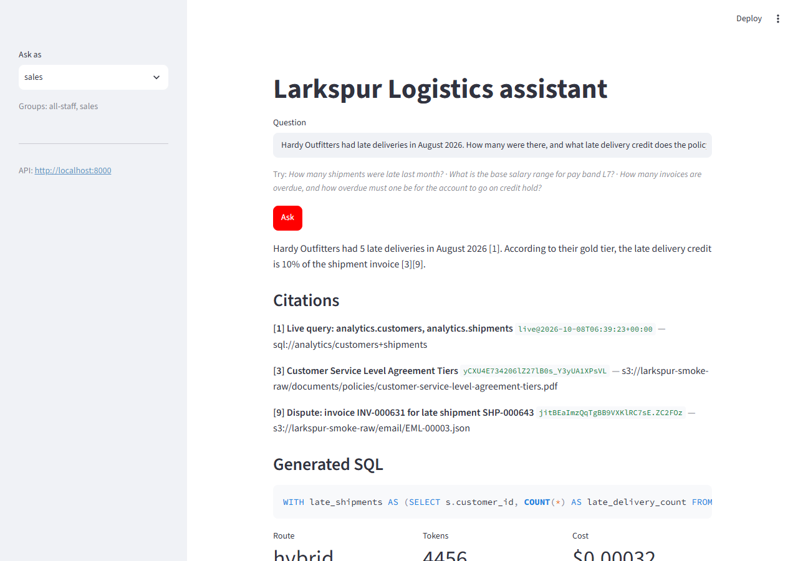

# lakehouse-rag

A production-grade enterprise RAG system for **Larkspur Logistics**, a fictional company. It answers questions across the kinds of sources a real company has:

| Source | Examples | How it's served |
|---|---|---|
| Documents in S3 | policy PDFs, SOP/product DOCX | hybrid vector + keyword search |
| Wiki | Markdown/HTML page tree, with stale and duplicate pages | hybrid vector + keyword search |
| Conversations | tickets, Slack threads, emails (JSON) | hybrid vector + keyword search |
| Operational DB | customers, shipments, invoices, employees (Postgres) | guarded text-to-SQL |

A router decides whether each question needs documents, SQL, or both.

> Status: all eight weeks are done. On 2026-10-08 the whole pipeline ran on real AWS (S3, SQS, Lambda, RDS, Bedrock) with the lake built by a Databricks Free Edition serverless job. It passed the evaluation gate with **0 ACL leaks**, and the stack was then destroyed. The [evidence](docs/smoke/2026-10-08/README.md) has screenshots, a recording, API responses and logs.



## Architecture

```
S3 raw/ ──event──► SQS ──► register Lambda ──► bronze manifest
Spark batch (Delta Lake): bronze → silver (parse, dedup, PII tag, ACLs) → gold (chunks, Change Data Feed)
Indexer: gold changes → bge-small embeddings (CPU) → Postgres + pgvector (+ tsvector, allowed_groups)
FastAPI /query (JWT groups): router → docs  | hybrid retrieval (RRF, ACL filter + RLS)
                                   → sql   | model-written SQL → sqlglot allowlist → rag_sql login, read-only txn
                                   → hybrid| SQL result + retrieved chunks as numbered sources
           → cited answer, refusal when evidence is missing, PII masked → token usage and cost per request
Streamlit: persona switcher to demonstrate access control
```

## Production-readiness goals
- **Evaluation gate:** a golden set scored on recall@k, MRR, router accuracy, SQL execution accuracy and LLM-judge faithfulness. CI fails on any regression, and on **any ACL leak**.
- **Access control:**
  - Retrieval is filtered by group, with Postgres row-level security as a second layer.
  - Text-to-SQL is enforced twice, independently: a sqlglot allowlist for views and functions, and a least-privilege login whose group context the query cannot change.
  - See [ADR 0002](docs/adr/0002-text-to-sql-isolation.md).
- **Grounding:** answers must cite their sources. Uncited or low-evidence answers become one uniform refusal, and retrieved text is wrapped as untrusted data.
- **Guardrails and resilience:** prompt-injection attempts in retrieved text are detected, counted and marked for the model rather than silently dropped; PII is masked in answers and in traces; `/query` is rate limited per caller; a circuit breaker stops a dead provider from costing every request its timeout.
- **Observability and cost:** structured JSON logs carrying identifiers but never content, Prometheus metrics with closed label sets, and USD cost per request. MLflow tracing is available but off by default, because a span records the question, the retrieved text and the answer. See [ADR 0004](docs/adr/0004-hardening-defaults.md).
- **IaC and CI/CD:** the same Terraform modules target [Floci](https://github.com/floci-io/floci) locally and real AWS for smoke tests. GitHub Actions runs lint, types, unit tests, `tflint`, `actionlint`, a checkov scan of the Terraform, a schema check of the Databricks bundle, then integration tests against a real Compose stack and the retrieval eval gate. `main` is protected: both jobs must pass. A merge to `main` then publishes the API and Spark images to `ghcr.io/stan-ely/lakehouse-rag-{api,spark}`, tagged `sha-<commit>` for deployments to pin and `main` for convenience. CI authenticates with the built-in token, so no registry credential is stored in the repository.
- **Databricks path:** the same Spark code ships as a Databricks Asset Bundle (serverless environment 6, Python 3.12 — the version mise pins locally). The job runs `ingestion/spark/run.py`, the module the ingest container runs, installed on the driver and executors as a wheel. Spark reaches the lake through a Unity Catalog external location, and bronze reads raw object versions through a UC service credential. One implementation, two configurations.

## Stack
Python 3.12 (matches Databricks serverless), FastAPI, PySpark + Delta Lake, Postgres 18 + pgvector, sqlglot, fastembed, Claude on Amazon Bedrock or the Anthropic API (pluggable; a fake provider for CI), MLflow 3, Terraform, Docker Compose, Floci, mise, uv.

## Quick start (local)
Prerequisites: Docker Desktop and [mise](https://mise.jdx.dev).

```sh
mise install        # pinned toolchain: python, uv, terraform, tflint, databricks cli, ...
mise run sync       # Python dependencies
mise run up         # Postgres+pgvector, Floci, MLflow
mise run tf-local   # buckets, queues, secrets and the register Lambda on Floci
mise run migrate    # schemas, roles, row-level security; enables local service logins
mise run seed       # generate Larkspur data: ops tables into Postgres, 157 documents into S3
mise run backfill   # register manifests for objects whose S3 events were missed (idempotent)
mise run ingest     # Spark container: bronze objects -> silver documents -> gold chunks (Delta)
mise run index      # embed changed gold chunks into pgvector (incremental via change feed)
mise run serve      # query API container on :8000 (768 MiB; `mise run ingest` stops it first)
mise run api        # or run it on the host with reload (RAG_LLM_PROVIDER=fake|bedrock|anthropic)
mise run ui         # Streamlit demo on :8501 (persona switcher; needs the API running)
mise run token sales  # JWT for a demo persona; then POST /query with `Authorization: Bearer ...`
mise run test       # unit tests
mise run test-integration
mise run eval       # score the golden set (retrieval only: deterministic, no model, no cost)
mise run scan       # checkov over the Terraform
mise run bundle-check  # databricks.yml against the bundle schema (no workspace needed)
```

## AWS smoke test (same day, then destroy)
Real S3, SQS, Lambda, RDS and Bedrock, with the Databricks Free Edition job building the lake. The laptop runs the indexer and the eval. It costs cents; a $5 budget alarm catches a forgotten destroy. The full sequence, including the two-pass Databricks credential setup, is in [ADR 0007](docs/adr/0007-aws-smoke-topology.md).

```sh
MISE_ENV=aws mise run tf-aws -var allowed_cidr=<your-ip>/32 -var budget_email=<you>
MISE_ENV=aws mise run smoke           # migrate, seed, register, ingest, index, eval, report
MISE_ENV=aws mise run evidence        # API responses, UI screenshots and recording, infra facts
MISE_ENV=aws mise run tf-aws-destroy
```

**Result of the 2026-10-08 run** ([report](docs/smoke/2026-10-08.md), [evidence](docs/smoke/2026-10-08/README.md)):

| | AWS + Databricks | Local baseline |
|---|---|---|
| Lambda manifests / Databricks job | 157 of 157, 0 errors / bronze → silver → gold in 2 min 49 s | – |
| Indexed into RDS | 156 documents, 330 chunks | – |
| Router accuracy | 0.936 | 0.927 |
| SQL execution success | 0.957 | 0.894 |
| Answer correctness | 0.917 | 0.899 |
| Recall@k (end to end) | 0.986 | 0.986 |
| **ACL leaks** | **0** | 0 |
| Cost per golden-set run / p50 latency | $0.014 / 3.8 s | $0.014 / 1.7 s |

Latency doubles because the laptop, in India, calls RDS in us-east-1 and Bedrock in us-west-2.

The run surfaced three differences between Databricks serverless and the local Spark, now fixed in the shared code (see [ADR 0007](docs/adr/0007-aws-smoke-topology.md)):
- `dbutils` cannot authenticate inside `foreachBatch`.
- Stopping the platform's session hangs the task.
- Serverless enables deletion vectors, which the delta-rs indexer cannot read.

A `/query` response carries:
- the answer and its citations
- `route` and `route_method` (`llm`, `heuristic` or `fallback`)
- any generated `sql` and `sql_error`, **only when `RAG_EXPOSE_SQL` is set** — the SQL names tables, columns and filters, so it is schema disclosure by default
- token usage, `cost_usd` and per-stage timings

The fake provider is deterministic and free. With it, routing always falls back to the heuristic and SQL generation does not succeed, so use `bedrock` or `anthropic` to see SQL answers.

The generator is deterministic (`--seed`, default 7) and dated as of 2026-08-31, which is also the API's reference date for relative periods (`RAG_AS_OF_DATE`). Re-running it uploads only objects whose content or ACL changed. Generated files and `manifest.json` land in `data/out/`.

Local runs target Floci by default. To use real AWS, set `MISE_ENV=aws`; this loads `mise.aws.toml` and removes the Floci endpoint overrides.

## Evaluation

`mise run eval` scores a golden set of 121 questions and fails on a regression or any ACL leak. Every expected answer is computed from the same modules that generate the corpus and the ops database (`data_gen/facts.py`, `data_gen/world.py`), so changing a business rule moves the documents, the rows and the expectations together instead of leaving a stale answer key.

| Case kind | Count | What it checks |
|---|---|---|
| docs | 62 | the document that answers the question is retrieved, and the answer states the fact |
| sql | 37 | the router picks `sql`, the generated query runs, and the number is right |
| hybrid | 10 | policy and live records are combined in one answer |
| acl | 12 | a caller without the group is refused, and the restricted text never reaches them |

Two profiles, gated by `eval/thresholds.yaml`:

```sh
mise run eval        # retrieval: index and ACLs only, no model, free -- this is the CI gate
mise run eval-full   # whole pipeline against real Bedrock; about a cent per run
```

Runs are logged to MLflow (`lakehouse-rag-eval` experiment on :5000) with the full per-case report as an artifact; `--no-mlflow` skips it, as CI does.

**Retrieval profile** (the index on its own): recall@k 1.00, MRR 0.94, **0 ACL leaks**. Hybrid questions used to miss their policy page, because tickets and emails about the named customer outranked it. They now search the document clause of the question on its own ([ADR 0005](docs/adr/0005-hybrid-document-subquery.md)); before that change, recall@k was 0.93.

**Full profile** on Amazon Nova Lite. [ADR 0003](docs/adr/0003-evaluation-model.md) compares three models, and [ADR 0006](docs/adr/0006-sql-prompt-over-model.md) covers the SQL prompt fix:

| metric | local | AWS smoke run |
|---|---|---|
| router accuracy | 0.927 | 0.936 |
| SQL execution success | 0.894 | 0.957 |
| answer correctness | 0.899 | 0.917 |
| recall@k (end to end) | 0.986 | 0.986 |
| refusal on restricted questions | 1.000 | 1.000 |
| **ACL leaks** | **0** | **0** |
| cost / p50 latency | $0.014 per run / 1.7 s | $0.014 per run / 3.8 s |

No model tried leaked restricted content or answered a question the caller had no right to, which is the point: access control lives in Postgres and the retrieval filter, not in the model's judgement.

## Design decisions
- [ADR 0001: Local memory budget](docs/adr/0001-local-memory-budget.md)
- [ADR 0002: Text-to-SQL isolation](docs/adr/0002-text-to-sql-isolation.md)
- [ADR 0003: Evaluation model choice](docs/adr/0003-evaluation-model.md)
- [ADR 0004: Hardening defaults](docs/adr/0004-hardening-defaults.md)
- [ADR 0005: Hybrid document subquery](docs/adr/0005-hybrid-document-subquery.md)
- [ADR 0006: Fix text-to-SQL in the prompt](docs/adr/0006-sql-prompt-over-model.md)
- [ADR 0007: AWS smoke topology](docs/adr/0007-aws-smoke-topology.md)

## Roadmap
1. ✅ Foundation: toolchain, Compose, Terraform on Floci, schema
2. ✅ Ingestion: Lambda register, Spark medallion jobs, incremental indexer
3. ✅ Retrieval and generation: hybrid search, citations, provider abstraction
4. ✅ Structured data: guarded text-to-SQL, router
5. ✅ Evaluation harness and CI gate
6. ✅ Hardening: guardrails, resilience, observability, Streamlit UI
7. ✅ CI/CD and Databricks bundle: security scanning, bundle schema check, image publishing
8. ✅ AWS smoke test and Databricks Free Edition run: passed on 2026-10-08, [evidence](docs/smoke/2026-10-08/README.md)
