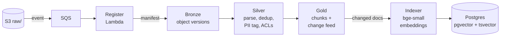
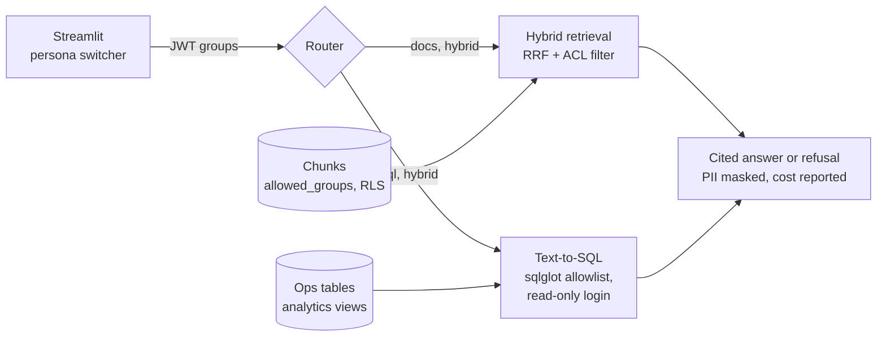

# lakehouse-rag

[](https://github.com/stan-ely/lakehouse-rag/actions/workflows/ci.yml)
[](LICENSE)

A production-grade enterprise RAG system for **Larkspur Logistics**, a fictional company. It answers employees' questions from the sources a real company has: policy PDFs, a wiki, support tickets, Slack and email, and a live operational database. Every answer respects who is asking.

## Highlights

- **0 access-control leaks, enforced in CI.** A 121-question golden set runs on every change, and a single leaked restricted sentence fails the build.
- **Ran for real, then torn down.** On 2026-10-08 the whole pipeline ran on AWS (S3, SQS, Lambda, RDS, Bedrock), with the lake built by a Databricks serverless job. It passed every evaluation threshold and was destroyed the same day. [Evidence](docs/smoke/2026-10-08/README.md): screenshots, a recording, API responses and logs.
- **Safe text-to-SQL.** The model writes SQL, so the system doesn't trust it. A sqlglot allowlist and a least-privilege database login guard each query independently, with Postgres row-level security underneath both.
- **A lakehouse for ingestion.** Spark builds Delta Lake medallion tables, and a change feed re-indexes only the documents that changed. The same code runs in a local container and on Databricks.
- **Decisions made by measurement.** Amazon Nova Lite was the only model that passed every threshold, at a fourteenth of Nova Pro's cost. The retrieval fix came from measuring where the misses ranked, not from adding a reranker.
- **Built on a 7.8 GB laptop.** Every service has a measured memory budget ([ADR 0001](docs/adr/0001-local-memory-budget.md)).

[Architecture](#architecture) · [Results](#results) · [Design decisions](#design-decisions) · [Run it](#run-it) · [Evidence](docs/smoke/2026-10-08/README.md)


## Architecture

| Source | Examples | How it's served |
|---|---|---|
| Documents in S3 | policy PDFs, SOP/product DOCX | hybrid vector + keyword search |
| Wiki | Markdown/HTML page tree, with stale and duplicate pages | hybrid vector + keyword search |
| Conversations | tickets, Slack threads, emails (JSON) | hybrid vector + keyword search |
| Operational DB | customers, shipments, invoices, employees (Postgres) | guarded text-to-SQL |

**Ingestion** (Spark runs locally in a container or as a Databricks serverless job):



**Serving** (FastAPI `/query`; every request carries the caller's groups):



1. **Ingestion is a lakehouse, not a script.** An S3 upload raises an event and a Lambda records it as a manifest. Spark builds the Delta tables: bronze holds raw object versions, silver parses, deduplicates, tags PII and carries each document's access list, and gold holds the chunks. Gold's change feed drives an incremental indexer, so editing one wiki page re-indexes only that page.
2. **Retrieval is hybrid.** Every chunk has an embedding and a `tsvector`, and the two rankings are fused with reciprocal rank fusion. The query filters on the caller's groups from their JWT, and row-level security enforces the same rule again inside Postgres.
3. **A router picks the route.** "What's the nightly hotel cap?" needs documents, "how many shipments were late in August?" needs SQL, and some questions need both. If the model fails or answers with anything but a route, a deterministic heuristic takes over.
4. **Answers cite or refuse.** An uncited or weakly supported answer becomes one uniform refusal, so a caller can't tell "nothing exists" from "something exists that you may not see".

## Results

`mise run eval-full` on Amazon Nova Lite, locally and in the AWS smoke run ([report](docs/smoke/2026-10-08.md)):

| Metric | Local | AWS + Databricks |
|---|---|---|
| Router accuracy | 0.927 | 0.936 |
| SQL execution success | 0.894 | 0.957 |
| Answer correctness | 0.899 | 0.917 |
| Recall@k (end to end) | 0.986 | 0.986 |
| Refusal on restricted questions | 1.000 | 1.000 |
| **ACL leaks** | **0** | **0** |
| Cost per golden-set run | $0.014 | $0.014 |
| p50 latency | 1.7 s | 3.8 s |

Latency doubles in the smoke run because the laptop, in India, calls RDS in us-east-1 and Bedrock in us-west-2. In that run the Lambda wrote 157 of 157 manifests with 0 errors, the Databricks job built bronze → silver → gold in 2 min 50 s, and 156 documents became 330 indexed chunks; silver collapsed one near-duplicate wiki page.

No model tried leaked restricted content or answered a question the caller had no right to. That is the point of the design: access control lives in Postgres and in the retrieval filter, not in the model's judgement.

**The golden set.** 121 questions. Every expected answer is computed from the same modules that generate the corpus and the ops database (`data_gen/facts.py`, `data_gen/world.py`), so changing a business rule moves the documents, the rows and the expectations together.

| Case kind | Count | What it checks |
|---|---|---|
| docs | 62 | the document that answers the question is retrieved, and the answer states the fact |
| sql | 37 | the router picks `sql`, the generated query runs, and the number is right |
| hybrid | 10 | policy and live records are combined in one answer |
| acl | 12 | a caller without the group is refused, and the restricted text never reaches them |

**Two profiles**, gated by [`eval/thresholds.yaml`](eval/thresholds.yaml):
- **Retrieval** (`mise run eval`): the index on its own, with no model and no cost. This is the CI gate. It scores recall@k 1.00, MRR 0.94 and **0 ACL leaks**. Hybrid questions used to miss their policy page because tickets about the named customer outranked it. They now search the document clause of the question on its own, which raised recall@k from 0.93 ([ADR 0005](docs/adr/0005-hybrid-document-subquery.md)).
- **Full** (`mise run eval-full`): the whole pipeline against real Bedrock, for about a cent per run. Runs are logged to MLflow with the per-case report as an artifact.

## Design decisions

| ADR | Decision |
|---|---|
| [0001](docs/adr/0001-local-memory-budget.md) | A measured memory limit for every container, so the stack fits a 7.8 GB laptop |
| [0002](docs/adr/0002-text-to-sql-isolation.md) | Text-to-SQL isolated by two independent layers, each tested with the other removed |
| [0003](docs/adr/0003-evaluation-model.md) | Nova Lite for evaluation, chosen by scoring three Nova and three open-weight models |
| [0004](docs/adr/0004-hardening-defaults.md) | Secure defaults: generated SQL and MLflow tracing are off unless asked for; injection is flagged, never dropped |
| [0005](docs/adr/0005-hybrid-document-subquery.md) | Fix hybrid recall by searching the document clause, not by adding a reranker |
| [0006](docs/adr/0006-sql-prompt-over-model.md) | Fix text-to-SQL errors in the prompt with worked examples, not by changing model |
| [0007](docs/adr/0007-aws-smoke-topology.md) | Managed services on AWS, compute on the laptop, destroyed the same day |

## Production readiness

- **Evaluation gate:** recall@k, MRR, router accuracy, SQL execution accuracy and LLM-judge faithfulness. CI fails on any regression and on **any ACL leak**.
- **Access control:** retrieval is filtered by group, with row-level security as a second layer. Text-to-SQL is enforced twice: a sqlglot allowlist of views and functions, and a least-privilege login whose group context the query cannot change.
- **Grounding:** answers must cite their sources. Uncited or low-evidence answers become one uniform refusal, and retrieved text is wrapped as untrusted data.
- **Guardrails and resilience:** prompt-injection attempts in retrieved text are detected and marked for the model, not silently dropped. PII is masked in answers and traces. `/query` is rate limited per caller, and a circuit breaker stops a dead provider from costing every request its timeout.
- **Observability and cost:** structured JSON logs carry identifiers but never content. Prometheus metrics use closed label sets, and every response reports its cost in USD.
- **IaC and CI/CD:** the same Terraform modules target [Floci](https://github.com/floci-io/floci) locally and real AWS. GitHub Actions runs lint, types, unit tests, `tflint`, `actionlint`, a checkov scan and a Databricks bundle schema check, then integration tests against a real Compose stack and the retrieval eval gate. `main` is protected. A merge publishes the API and Spark images to `ghcr.io/stan-ely/lakehouse-rag-{api,spark}`, tagged `sha-<commit>` and `main`, using only the built-in token.
- **Databricks:** the same Spark code ships as a Databricks Asset Bundle (serverless environment 6, Python 3.12, the version mise pins locally). Spark reaches the lake through a Unity Catalog external location, and bronze reads raw object versions through a UC service credential. One implementation, two configurations.

## Stack

Python 3.12, FastAPI, PySpark + Delta Lake, Postgres 18 + pgvector, sqlglot, fastembed, Claude or Amazon Nova on Bedrock or the Anthropic API (pluggable, with a fake provider for CI), MLflow 3, Streamlit, Terraform, Docker Compose, Floci, mise, uv.

## Run it

### Locally
Prerequisites: Docker Desktop and [mise](https://mise.jdx.dev).

```sh
mise install        # pinned toolchain: python, uv, terraform, tflint, databricks cli, ...
mise run sync       # Python dependencies
mise run up         # Postgres+pgvector, Floci, MLflow
mise run tf-local   # buckets, queues, secrets and the register Lambda on Floci
mise run migrate    # schemas, roles, row-level security; enables local service logins
mise run seed       # generate Larkspur data: ops tables into Postgres, 157 documents into S3
mise run backfill   # register manifests for objects whose S3 events were missed (idempotent)
mise run ingest     # Spark container: bronze objects -> silver documents -> gold chunks (Delta)
mise run index      # embed changed gold chunks into pgvector (incremental via change feed)
mise run serve      # query API container on :8000 (768 MiB; `mise run ingest` stops it first)
mise run api        # or run it on the host with reload (RAG_LLM_PROVIDER=fake|bedrock|anthropic)
mise run ui         # Streamlit demo on :8501 (persona switcher; needs the API running)
mise run token sales  # JWT for a demo persona; then POST /query with `Authorization: Bearer ...`
mise run test       # unit tests
mise run test-integration
mise run eval       # score the golden set (retrieval only: deterministic, no model, no cost)
mise run eval-full  # whole pipeline against real Bedrock; about a cent per run
mise run scan       # checkov over the Terraform
mise run bundle-check  # databricks.yml against the bundle schema (no workspace needed)
```

<details>
<summary>API response, providers and generated data</summary>

A `/query` response carries:
- the answer and its citations
- `route` and `route_method` (`llm`, `heuristic` or `fallback`)
- any generated `sql` and `sql_error`, **only when `RAG_EXPOSE_SQL` is set**: the SQL names tables, columns and filters, so it is schema disclosure by default
- token usage, `cost_usd` and per-stage timings

The fake provider is deterministic and free. With it, routing always falls back to the heuristic and SQL generation does not succeed, so use `bedrock` or `anthropic` to see SQL answers.

The generator is deterministic (`--seed`, default 7) and dated as of 2026-08-31, which is also the API's reference date for relative periods (`RAG_AS_OF_DATE`). Re-running it uploads only objects whose content or ACL changed. Generated files and `manifest.json` land in `data/out/`.

MLflow runs go to the `lakehouse-rag-eval` experiment on :5000; `--no-mlflow` skips logging, as CI does.

Local runs target Floci by default. To use real AWS, set `MISE_ENV=aws`; this loads `mise.aws.toml` and removes the Floci endpoint overrides.

</details>

### On AWS (same day, then destroy)
Real S3, SQS, Lambda, RDS and Bedrock, with the Databricks Free Edition job building the lake. The laptop runs the indexer and the eval. It costs cents, and a $5 budget alarm catches a forgotten destroy. The full sequence, including the two-pass Databricks credential setup, is in [ADR 0007](docs/adr/0007-aws-smoke-topology.md).

```sh
MISE_ENV=aws mise run tf-aws -var allowed_cidr=<your-ip>/32 -var budget_email=<you>
MISE_ENV=aws mise run smoke           # migrate, seed, register, ingest, index, eval, report
MISE_ENV=aws mise run evidence        # API responses, UI screenshots and recording, infra facts
MISE_ENV=aws mise run tf-aws-destroy
```

The 2026-10-08 run surfaced three differences between Databricks serverless and local Spark, now handled in the shared code:
- `dbutils` cannot authenticate inside `foreachBatch`.
- Stopping the platform's session hangs the task.
- Serverless enables deletion vectors, which the delta-rs indexer cannot read.

## Status

All eight planned milestones are done, from the toolchain and ingestion through evaluation, hardening, CI/CD and the AWS + Databricks smoke run. The git history follows them.

## License

[MIT](LICENSE)
